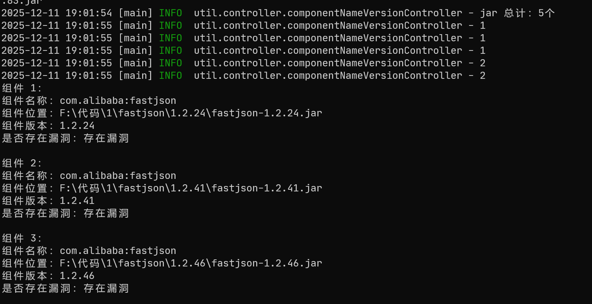
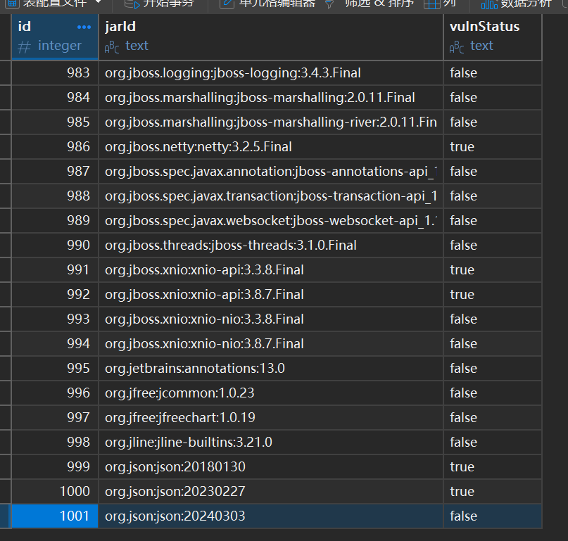

## JavaAppExtract

[TOC]

### 基础介绍：

用来扫描java项目中开源组件是否存在漏洞，注意：使用本工具需要联网

通过https://mvnrepository.com/站点获取组件是否存在漏洞

大版本更新2.0，添加数据库进行本地缓存

### 使用方法：

java -jar xxx.jar

根据提示指定项目的lib目录即可

下图中 1 1 1 2 2，代表获取组件版本时，是在数据库进行读取，1是存在漏洞，2是不存在漏洞，0是本地数据库不存在该组件，并且加载缓存到本地数据库

当前提供数据库内存在1000条组件版本信息

### 下载建议：

编译环境：jdk8u471

最小化工具，数据库中不存在任何数据：JavaAppExtract-2.0-Minimum.7z

标准工具，数据库中存在1000条数据：JavaAppExtract-2.0-Standard.7z

源码：src.zip